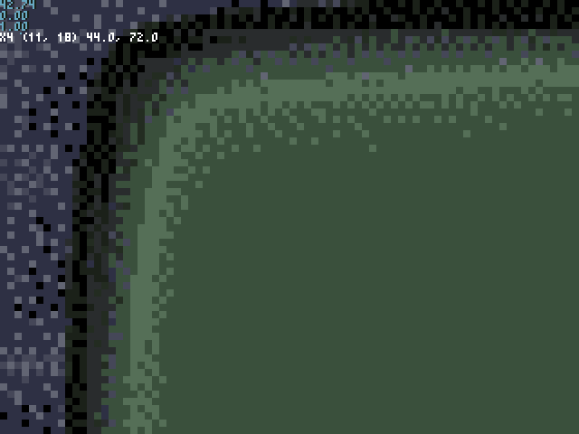

## Pan/Zoom Lab

Another quick code lab for Pyxel to answer the question:

"What's the max dimension of an off-screen image in Pyxel?"

TLDR; There's virtually no max.

I went to the stupid 13440x10080 (320x240 x 42) to be sure.

## Install

This project uses [Poetry](https://python-poetry.org "At last python has more or less caught up with modernity about dependency management"), so all you have to do is install Poetry and run `poetry install` in this project directory.

## Run

`poetry run python panzoomlab_pyxel/main.py`

